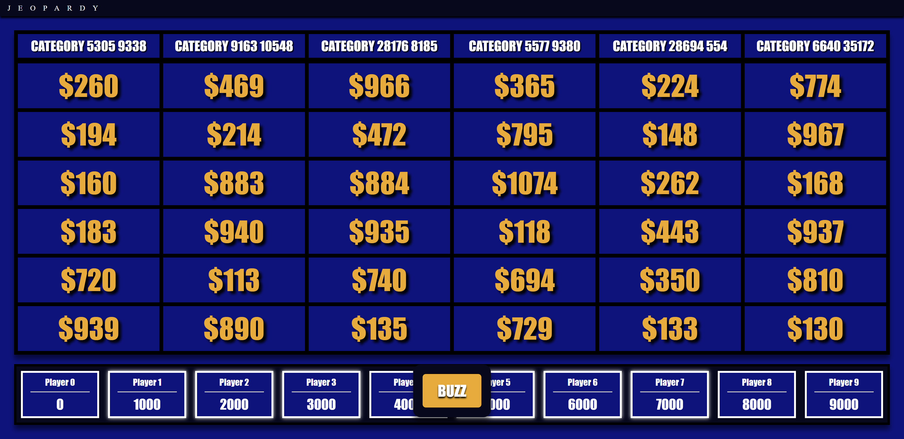

# jeopardy-rs
`jeopardy-rs` is a project built using [`tokio`](https://tokio.rs/) and [`axum`](https://github.com/tokio-rs/axum) for web functionality and is designed to mimic the [Jackbox](https://www.jackboxgames.com/) style of party games. Websockets are used with an actor-model based [lobby handler](https://github.com/albertbregonia/jeopardy-rs/blob/main/stagecrew/src/lobby/actor_lobby.rs) to ingest concurrent updates to game state and broadcast events to players.



# features
- multi-lobby support on a single instance allowing different groups to play their own respective game
- custom board support allowing users to create and use their own custom questions, categories and point values
- live broadcasted game events for performance
- auto-cleanup for empty lobbies with a grace period 
- middleware for request IDs using `tracing` and `tracing-subscriber` for readable logging

# how to run

if you wish to use all the default parameters, simply:
```bash
cargo run --release
```

otherwise, use env vars to specify parameters, the defaults are used here:
```bash
PORT=8080 STATIC_DIR="./static" cargo run --release
```

where
| Name | Description | Valid Input |
| - | - | - |
| `PORT` | the tcp listener port to be used by the web server (axum) | 1-65535 |
| `STATIC_DIR` | directory for the static assets of the web frontend (html/css/js) | absolute or relative path (format is OS dependent) |

# testing

`cargo tarpaulin` was used to see unit test coverage
```bash
cargo install cargo-tarpaulin
cargo tarpaulin
```

# background
Originally, this project was created for my mother's birthday as a big party game that all the guests could play in teams/individually. The original code was built in a week, and was very much hard-coded to be a jeopardy web server. I eventually decided to make it into a production-grade project that could scale for multiple reasons:
1. To be a capstone of my current abilities as a software engineer as of 2026
2. To be a reusable library as most of my projects are based around live, multiplayer, web games
3. To experience first-hand, creating a codebase from scratch as opposed to inheriting one from work
